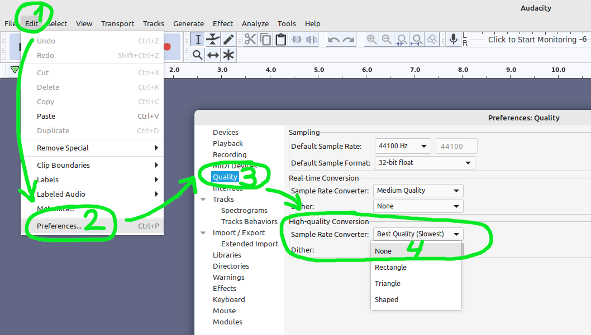
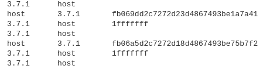
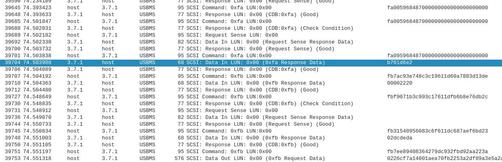

([listen](https://www.youtube.com/watch?v=uRhmus2BdKc&t=31s) to this image if you can't read cyrillic)

# AppoTech / Buildwin firmware modification tools
This repository is my work on reverse-engineering my fake chinese JBL speaker. My initial goal was to properly replace the default awful voiceover but I ended up developing few more programs. I decided to make them public so everyone could try modifying the firmware of their AppoTech / Buildwin speakers. I tried to impose as few restrictions as possible to allow experimenting with firmware.

# Introduction
The programs in the repository are exclusively for the AppoTech platform, also known as Buildwin. Do not use these tools on speakers based on chips from other manufacturers. You can easily recognize an AT/BW chip by the manufacturer's logo on the chip: .

If you want to try to proceed without tearing down your speaker you can try connecting it to PC. I have not figured out (yet) the reliable and always working way to boot into the USB Mode while the firmware is fine. However if your speaker got recognized by the PC with USB VID `1908` then it's AppoTech / Buildwin.

At this moment the most reliable way to work with firmware is unsoldering the SPI flash IC and reading/dumping its whole contents. I used [flashrom](https://github.com/flashrom/flashrom) on Linux for this purpose.

Further in the text `firmware.bin` will be referred to as the complete SPI memory image of the speaker.

⚠️ **The user is expected to read the help** (`./xxxxxxxxxxx.py -h`) before working with the program. The following are the most common examples of program usage.

# appotech-sfx
Program for modifying firmware sound resources. Your one-stop solution for getting rid of "the chinese lady" voiceover. It has been created as result of reverse-engineering the official [MP3RESTOOL utility](https://github.com/Edragon/buildwin/blob/master/Tools/MP3RESTOOL/EN/MP3RESTOOL.exe) for Windows. The only difference is `appotech-sfx` doesn't generate the `.h` file. Well, we don't need it anyway.

Caveat: you'll have to make your own SFX pack, but with emergence of AI tools such as RVC/RVCv2 you can easily make any voiceover you like.

### Extract the original SFX files
`./appotech-sfx.py -e ./my-sfx-files firmware.bin`

This command reads `firmware.bin` and extracts individual files into `./my-sfx-files` directory. It will be created automatically if it doesn't exist.

### Modify the SFX files
**Do not change the original order of the files** unless you're fuzzing the firmware and intentionally trying to find bugs in it. First go the MP3s, then go the WAVs. The firmware cannot decode MP3 while in Bluetooth mode, this is exactly why it has a set of WAV files.

**Warning for Audacity users!** You **must** disable dithering before exporting any modified WAV file:

The WAV files will have very loud unpleasant noise if you don't disable dither. Dither is a long-time "feature" of Audacity but it's broken for low-samplerate projects such as AppoTech SFX.

**Keep an eye on the total size of audio files!** Do your best to avoid exceeding the size of the original SFX blob. This is very important.

### Pack the new SFX blob and inject it into the firmware
`./appotech-sfx.py -O firmware.bin ./my-sfx-files`

This will not overwrite the original firmware but create a new file.

# appotech-btinfo
Program for modifying the Bluetooth settings. If such option was enabled by the manufacturer of your speaker (those are enabled at compile time) then you can override the default Bluetooth name and MAC address, as well as set up Mute settings.

### Change the Bluetooth name of the speaker
`./appotech-btinfo.py -i firmware.bin -S bt_name "Ze Blootoos diwice" -O firmware-mod.bin`

### Change the Bluetooth MAC of the speaker
`./appotech-btinfo.py -i firmware.bin -S bt_mac "13:37:00:00:13:37" -O firmware-mod.bin`

Actually you can change both name and MAC in one command. Read `-h` for details.

# appotech-btpairing
Program for modifying the database of paired/connected devices. Can be useful for dumping Bluetooth Link Keys.

### Print all saved devices
`./appotech-btpairing.py -i firmware.bin -p`

### Change the latest active device index
`./appotech-btpairing.py -i firmware.bin -x 0 -O firmware-mod.bin`
This will make the speaker try to connect to the specified device after poweron. Is it a [DOS](https://en.wikipedia.org/wiki/Denial-of-service_attack) opportunity..?

**The amount of devices saved is decided by the speaker manufacturer**, the size is hardcoded when the firmware is compiled. I have no idea (yet) how to access this value. Usually it's 3~6. For example it's 4 on my speaker.

# Future prospects
## Reverse engineering the USB flashing protocol
**Note**: the draft of this chapter was originally written in Russian (my native language), you are reading a machine translation by DeepL. If you find any mistake, I would be grateful for Pull Requests with corrections.

The AT/BW controllers have a USB flashing feature. It is activated automatically under certain circumstances, e.g. when SPI memory could not be initialised or when the battery is disconnected from the speaker. The speaker is then recognised as a blank USB Mass Storage drive when connected to a computer via USB.

There is an official MPTool program for Windows that flashes SPI memory in the speaker. This is very interesting because you can easily flash the memory without having to unsolder the chip or make converters.

Since the speaker is pretending to be an empty drive, it does not need a separate driver and/or Zadig fiddling, and the program uses only the native `DeviceIoControl` function from WinApi. Once started, the program waits for the speaker to connect. When connected, the program checks its name (in my case it is `Buildwin SPI08080-Loader 1.02`) and dynamically loads a small module (in my case `spi0802_driver.dll`) from the working directory, after which it performs a handshake with the speaker and begins the SPI memory chip identification routine. This is done by loading the database of supported memory from `FlashLib.ini`, testing the ID of each chip one by one until the operation succeeds. In case of failure (e.g. when the SPI chip is not supported by the software), the chip IDs will be logged.

During operation MPTool sends SCSI commands to the speaker and receives responses from it. The problem is that after the handshake is complete, the communication is encrypted. Actually, I can't really call this "encryption", more like "scrambling", for the following reasons:
1. MPTool does not use AES and similar algorithms when communicating with the speaker. On the contrary, quite a few XOR operations are used in creating the outgoing command.
2. The entropy of the intercepted USB traffic remains low after the handshake, indicating that no encryption is used. Even some patterns in the scrambled commands could be seen in Wireshark:

It is interesting to note that during the handshake, the speaker responds with some kind of 4-byte value, which is presumably then used in scrambling the traffic. In addition, only the commands coming from the computer are scrambled, while the speaker's responses are received in plain text.

The problem is exacerbated by the fact that when repeating the same operation (I tested MPTool in SPI memory identification mode, i.e. when the `FlashLib.ini` file does not contain any chips) the outgoing traffic is not repeated. During handshake, the speaker responds with different 4-byte values. It is possible that this has some connection. The picture below shows the handshake and the start of communication opened in Wireshark. The highlighted value returned by the speaker is always different. 

You can notice that 2 opcodes are used: `0xFA` and `0xFB`, and scrambling is most likely used only with `0xFB` opcodes.

I was trying to find some information and came across the repository [kagaimiq/ax225](https://github.com/kagaimiq/ax225/blob/87b0a5e4db88a0c3c63b9bb4b25d1d85300b1067/progs/ax225fun.py#L70). His script for handshake also uses `0xFA0059684870`, but when I tried other commands from this repository, they didn't work.

I will keep trying ocassionally but to be honestly I'm sure I won't succeed. **Any help is greatly welcome!**

## Reverse engineering the self-update feature
According to [this document](https://github.com/Edragon/buildwin/blob/master/AX2227_BTBOXSDK_V110_20141010/DOC/SD%E5%8D%A1%E5%8D%87%E7%BA%A7%E6%A8%A1%E5%BC%8F.pdf), the speaker *might* have a self-update feature that could allow loading the modded firmware from microSD card. Self-update is an optional component of firmware and the manufacturer can disable it at compile time. The document says there are many ways to flash the firmware, and I'm particularly interested in "force mode" that disables all "safety mechanisms" and overwrites the whole SPI flash with contents of `updatefw.bin` or `upd_app.bin`.

**Caveat**: the `bwwhpupd.xbt` file is required to enter "force mode". You can check out [the contents of this file here](https://github.com/Edragon/buildwin/blob/master/AX2227_BTBOXSDK_V110_20141010/APP_LLP/Debug/Exe/bin/bwwhpupd.xbt). It is unknown how this file is generated and if it could ever be reused on other speakers because multiple other docs mention signing and encrypting the firmware. I could not enter the self-update mode (by holding Next/Vol+ while powering on) because my speaker seems to have this feature disabled.
